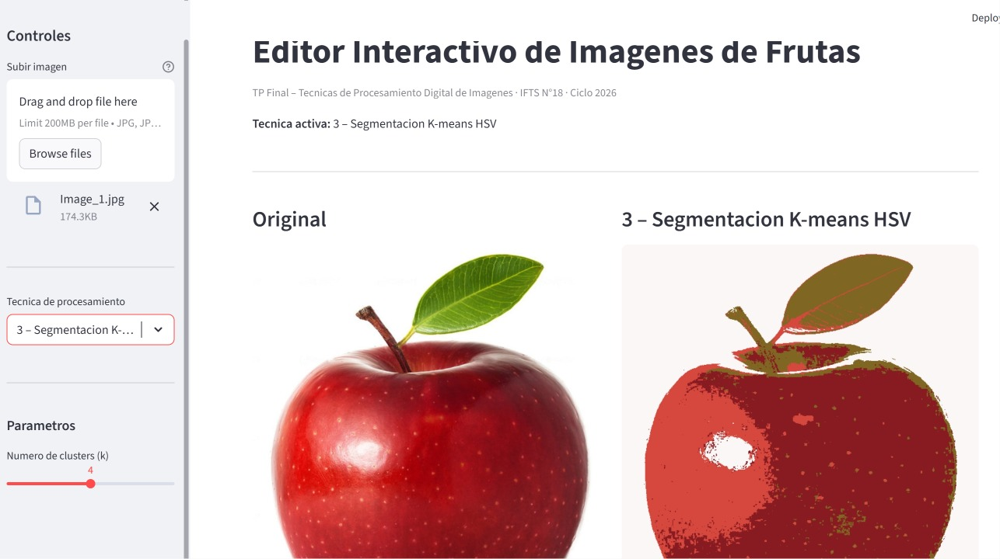
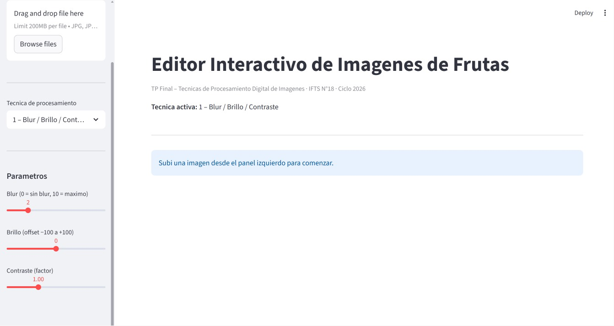
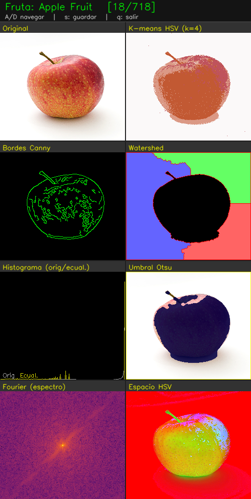
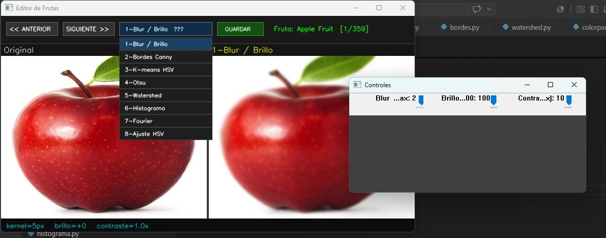

# Editor Interactivo de Imágenes de Frutas
## Trabajo Práctico Final – Técnicas de Procesamiento Digital de Imágenes

**Carrera:** Tecnicatura Superior en Ciencia de Datos e Inteligencia Artificial  
**Instituto:** IFTS N°18 – CABA  
**Profesor:** Bonini Juan Ignacio  
**Ciclo:** 2026  
**Alumnos:** Armiento, Fernando – Caviglia, Paula  

---

## 1. Descripción del proyecto

Aplicación de procesamiento de imágenes de frutas con dos interfaces:

- **Interfaz de escritorio** (`main.py`) — ventana OpenCV con sliders interactivos en tiempo real
- **Interfaz web** (`app.py`) — app Streamlit con sliders y carga de imagen desde el disco

Ambas interfaces usan exclusivamente la clase `Motor` del core. No duplican lógica de procesamiento.

El foco del proyecto es la **edición y manipulación de imágenes**, no el procesamiento automático. El usuario controla los parámetros con sliders y ve el efecto al instante.

---

## 2. Problema que resuelve

Las técnicas de procesamiento digital de imágenes son difíciles de entender en abstracto. Esta herramienta permite visualizar en tiempo real cómo afecta cada parámetro a una imagen concreta, facilitando tanto el aprendizaje como la exploración práctica de los algoritmos.

Casos de uso reales del mismo concepto:
- Clasificación automática de frutas en supermercados
- Detección de madurez en cosechas por drones
- Segmentación de tumores en imágenes médicas
- Guía visual para brazos robóticos

---

## 3. Arquitectura del proyecto (POO)

El proyecto aplica Programación Orientada a Objetos con tres clases principales:

- **`PillowProcessor`** — operaciones básicas con Pillow: blur, brillo, contraste, grises. Métodos encadenables.
- **`OpenCVProcessor`** — técnicas avanzadas con OpenCV: Canny, K-means, Otsu, Watershed, histograma, Fourier, HSV. Delega en los módulos existentes sin duplicar lógica.
- **`Motor`** — fachada principal del core. Es la única clase que importan `main.py` y `app.py`. Permite reutilizar el core desde cualquier interfaz sin modificaciones.

---

## 4. Técnicas implementadas

| Módulo | Técnica |
|--------|---------|
| `bordes.py` | Detección de bordes con Canny y Sobel |
| `color.py` | Conversión de espacios de color (BGR, HSV, HLS) |
| `histograma.py` | Histogramas y ecualización por canal |
| `morfologia.py` | Erosión, dilatación, apertura y cierre |
| `segmentacion_kmeans.py` | Segmentación por color con K-means |
| `segmentacion_otsu.py` | Umbralización automática con Otsu |
| `watershed.py` | Separación de objetos con Watershed |
| `pillow_processor.py` | Clase PillowProcessor — operaciones básicas |
| `opencv_processor.py` | Clase OpenCVProcessor — técnicas avanzadas |
| `motor.py` | Clase Motor — fachada del core reutilizable |
| `main.py` | Interfaz escritorio con OpenCV y sliders |
| `app.py` | Interfaz web con Streamlit |

---

## 5. Modos de visualización interactivos

Disponibles en ambas interfaces:

- **Modo 1** – Blur gaussiano + brillo y contraste ajustables (via PillowProcessor)
- **Modo 2** – Bordes con Canny (sliders de umbral bajo y alto)
- **Modo 3** – Segmentación K-means (slider para elegir k de 2 a 6)
- **Modo 4** – Umbralización Otsu (automática o manual)
- **Modo 5** – Watershed (slider de umbral de transformada de distancia)
- **Modo 6** – Histograma por canal R, G, B o grises con ecualización
- **Modo 7** – Transformada de Fourier con filtro pasa bajos ajustable
- **Modo 8** – Ajuste de tono, saturación y brillo en espacio HSV

---

## 6. Dataset

| Campo | Detalle |
|-------|---------|
| Nombre | Fruits Dataset (Images) |
| Fuente | [Kaggle – shreyapmaher/fruits-dataset-images](https://www.kaggle.com/datasets/shreyapmaher/fruits-dataset-images) |
| Motivo | Dataset liviano, imágenes limpias organizadas por carpeta de fruta |

La versión web (`app.py`) permite subir cualquier imagen desde el disco, sin depender del dataset.

---

## 7. Librerías utilizadas

| Librería | Uso |
|----------|-----|
| `opencv-python` | Procesamiento de imágenes, interfaz escritorio, sliders |
| `numpy` | Operaciones matriciales sobre píxeles |
| `scikit-learn` | Algoritmo K-means |
| `Pillow` | Operaciones básicas: blur, brillo, contraste, grises |
| `streamlit` | Interfaz web interactiva (app.py) |
| `matplotlib` | Referencia para cálculo de histogramas |

---

## 8. Cómo ejecutar el proyecto

**1. Instalar dependencias:**
```bash
pip install -r requirements.txt
```

**2. Descargar el dataset desde Kaggle y colocarlo en la carpeta `images/`**

**3a. Ejecutar la interfaz de escritorio:**
```bash
python main.py
```

Navegación: `A` / `D` para cambiar de imagen, `S` para guardar, `Q` para salir.

**3b. Ejecutar la interfaz web:**
```bash
streamlit run app.py
```

Se abre en el navegador. Subí una imagen desde el panel izquierdo y ajustá los sliders.

---

## 9. Capturas de pantalla

### Interfaz web (Streamlit)




### Interfaz de escritorio (OpenCV)


